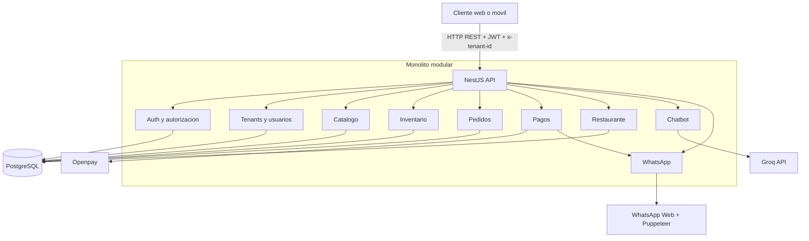
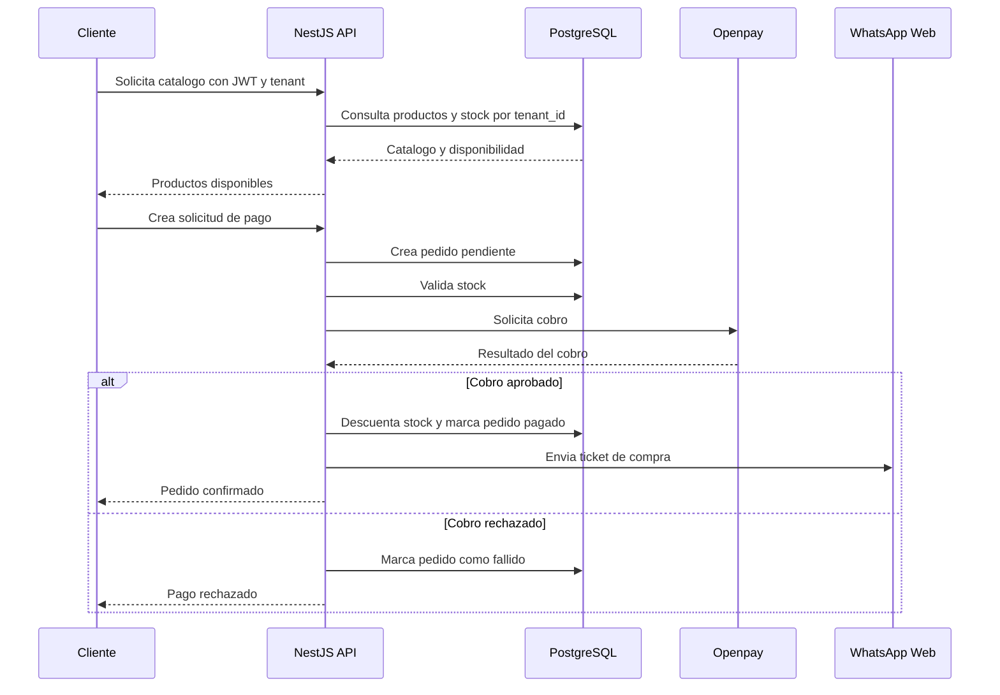
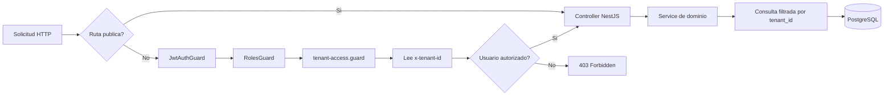
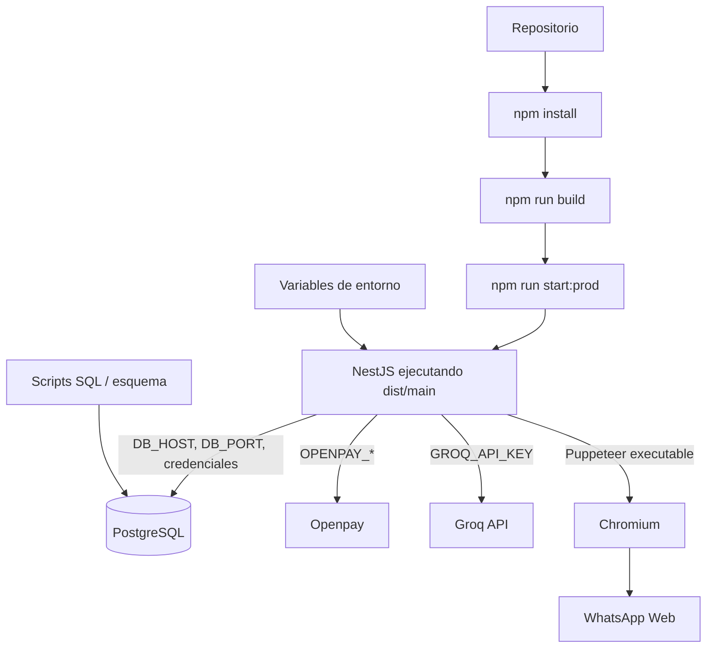

# 🚀 DRCV Punto de Venta - Core Backend

[](https://nestjs.com/) [](https://www.typescriptlang.org/) [](https://www.postgresql.org/) [](https://typeorm.io/)

[](https://jwt.io/) [](https://jestjs.io/) [](https://www.openpay.mx/) [](#estado-del-proyecto)

Backend REST modular para una plataforma SaaS de punto de venta **multi-tenant**. Centraliza catálogo, inventario, pedidos, pagos y operaciones de distintos negocios y sucursales desde una misma API construida con NestJS y PostgreSQL.

La aplicación está pensada para tiendas de abarrotes, ferreterías, restaurantes y otros comercios que comparten un núcleo operativo, pero necesitan mantener sus datos separados por negocio. Incluye integraciones reales con Openpay, Groq y WhatsApp Web.

> **Estado del proyecto:** desarrollo y aprendizaje avanzado. Los módulos principales están implementados, pero todavía se requiere endurecimiento de seguridad, pruebas y operación antes de usarlo como plataforma de producción.

## 🧭 Índice

- [Qué incluye](#-qué-incluye)
- [Arquitectura](#-arquitectura)
- [Stack tecnológico](#-stack-tecnológico)
- [Inicio rápido](#-inicio-rápido)
- [Variables de entorno](#-variables-de-entorno)
- [Pruebas y comandos](#-pruebas-y-comandos)
- [Despliegue](#-despliegue)
- [Mejoras pendientes](#-mejoras-pendientes-antes-de-producción)
- [Estado del proyecto](#-estado-del-proyecto)

## ✨ Qué incluye

| Dominio | Capacidades |
| --- | --- |
| 🔐 **Identidad** | Registro, login, JWT, roles y autorización por tenant |
| 🏪 **Multi-tenant** | Negocios, propietarios, sucursales y separación lógica de datos |
| 📦 **Catálogo** | Productos, variantes, precios, costos, códigos de barras y catálogo global |
| 📊 **Inventario** | Existencias por sucursal, ajustes, aprobaciones y alertas de stock |
| 🧾 **Pedidos** | Creación, seguimiento, reportes y flujo de estados |
| 💳 **Pagos** | Cobros y webhooks mediante Openpay |
| 🍽️ **Restaurante** | Mesas y estadísticas operativas |
| 🤖 **Automatización** | Chatbot con Groq y tickets enviados por WhatsApp Web |
| 🛡️ **API** | CORS para frontend y throttling global de solicitudes |

## Stack tecnológico

### Aplicación

- Node.js
- TypeScript
- NestJS 11
- Express mediante `@nestjs/platform-express`
- REST API
- DTOs con `class-validator` y `class-transformer`

### Persistencia y seguridad

- PostgreSQL
- TypeORM
- Passport
- Passport Local
- Passport JWT
- JWT
- bcrypt
- Throttler de NestJS

### Integraciones

- Openpay para pagos.
- Groq SDK para el chatbot.
- `whatsapp-web.js` para mensajería y tickets.
- Puppeteer para generar imágenes de tickets y operar WhatsApp Web.
- `qrcode-terminal` para autenticar la sesión de WhatsApp desde la terminal.

### Pruebas y calidad

- Jest
- Supertest
- ESLint
- Prettier

El frontend no está incluido en este repositorio. El backend expone la API que puede consumir una aplicación web o móvil.

## Arquitectura

La aplicación utiliza un monolito modular organizado alrededor de dominios de negocio:

```text
Cliente web o móvil
        |
        | HTTP / REST / JWT / x-tenant-id
        v
NestJS
  ├── Auth y autorización
  ├── Tenants y usuarios
  ├── Catálogo
  ├── Inventario
  ├── Pedidos
  ├── Pagos
  ├── Restaurante
  ├── Chatbot
  └── WhatsApp
        |
        +── PostgreSQL mediante TypeORM
        +── Openpay
        +── Groq
        +── WhatsApp Web / Puppeteer
```

El aislamiento entre negocios se implementa principalmente a nivel de aplicación. Las entidades de productos, inventario y pedidos mantienen un `tenant_id`, y los guards verifican autenticación, roles y acceso al tenant solicitado.

El contexto del tenant se obtiene mediante el middleware de [src/common/middlewares/tenant.middleware.ts](src/common/middlewares/tenant.middleware.ts), que lee el header `x-tenant-id`. La autorización se complementa con `JwtAuthGuard`, `RolesGuard` y `TenantAccessGuard`.

Esta es una separación lógica dentro de una base de datos compartida; no son bases de datos independientes por tenant ni microservicios separados.

### Diagrama ASCII

El siguiente diagrama utiliza únicamente caracteres compatibles con Markdown y GitHub:

```text
+------------------+       REST / JWT        +---------------------------+
| Frontend web     | ----------------------> | NestJS                    |
| o movil          |       x-tenant-id       | Monolito modular          |
+------------------+                         | Auth | Catalogo | Orders  |
                    | Stock | Pagos    | Chatbot |
                    +-------------+-------------+
                        |
                     TypeORM / tenant_id
                        |
          +-------------------+-------------+-------------------+
          |                   |                                 |
          v                   v                                 v
        +--------------+   +--------------+                 +----------------+
        | PostgreSQL   |   | Openpay      |                 | Groq + WhatsApp|
        | datos SaaS   |   | pagos        |                 | Web + Puppeteer|
        +--------------+   +--------------+                 +----------------+
```

### Arquitectura general



### Flujo principal de compra



### Autenticación y acceso a datos



El diagrama representa el flujo previsto por los guards y servicios actuales. La aplicación utiliza una base de datos compartida y el aislamiento se realiza mediante `tenant_id`; no se presenta como aislamiento físico entre bases de datos.

### Despliegue



El repositorio no incluye Dockerfile, Docker Compose ni CI/CD. El diagrama muestra el flujo de despliegue Node.js documentado actualmente, no una infraestructura cloud automatizada.

## Estructura de carpetas

```text
src/
├── auth/                  # Login, registro, JWT, Passport y guards
├── common/                # Middleware y decoradores compartidos
├── modules/
│   ├── catalogo/          # Productos, variantes y catálogo global
│   ├── chatbot/           # Chatbot conectado con Groq
│   ├── inventario/        # Existencias y ajustes
│   ├── orders/            # Pedidos, entregas y reportes
│   ├── payments/          # Cobros y webhooks de Openpay
│   ├── restaurant/        # Mesas y operaciones de restaurante
│   └── whatsapp/          # Tickets y notificaciones
├── tenants/               # Negocios y relaciones con propietarios
├── users/                 # Usuarios y permisos por tenant
├── types/                 # Declaraciones TypeScript externas
├── app.module.ts          # Composición de la aplicación
└── main.ts                # Bootstrap, CORS y puerto HTTP

sql/                      # Esquema, correcciones y datos de demostración
scripts/                  # Seeds y utilidades SQL/Node.js
test/                     # Pruebas end-to-end
```

Cada módulo de dominio suele separar controller, service, DTOs y entities. Los controllers exponen endpoints, los services contienen reglas de negocio y las entities representan el modelo persistido mediante TypeORM.

## Requisitos

- Node.js compatible con las dependencias del proyecto.
- npm.
- PostgreSQL.
- Chromium compatible con Puppeteer si se utiliza la integración de WhatsApp.
- Credenciales de Openpay para habilitar el módulo de pagos.
- API key de Groq para utilizar el chatbot.

## Instalación local

1. Instalar dependencias:

   ```bash
   npm install
   ```

2. Crear una base de datos PostgreSQL. Por defecto, la aplicación espera una base llamada `punto_venta_saas` en `localhost:5432`.

3. Configurar las variables de entorno descritas en la siguiente sección.

4. Preparar el esquema y los datos necesarios utilizando los scripts SQL del repositorio. Entre los archivos disponibles se encuentran `restore_schema.sql`, `sql/` y `scripts/`. Los scripts de población de demostración requieren adaptar los UUIDs indicados en sus comentarios.

5. Iniciar el servidor en modo desarrollo:

   ```bash
   npm run start:dev
   ```

La API escucha por defecto en `http://localhost:3001`.

## Variables de entorno

| Variable | Uso | Valor por defecto o requisito |
| --- | --- | --- |
| `PORT` | Puerto HTTP de la API | `3001` |
| `NODE_ENV` | Entorno de ejecución | Si es `production`, TypeORM no ejecuta `synchronize` |
| `DB_HOST` | Host de PostgreSQL | `localhost` |
| `DB_PORT` | Puerto de PostgreSQL | `5432` |
| `DB_USERNAME` | Usuario de PostgreSQL | `postgres` |
| `DB_PASSWORD` | Contraseña de PostgreSQL | `postgres` |
| `DB_NAME` | Nombre de la base de datos | `punto_venta_saas` |
| `JWT_SECRET` | Secreto para firmar y validar JWT | Definir uno seguro; no usar el fallback en producción |
| `OPENPAY_MERCHANT_ID` | Identificador del comercio Openpay | Requerida por el módulo de pagos |
| `OPENPAY_PRIVATE_KEY` | Llave privada de Openpay | Requerida por el módulo de pagos |
| `OPENPAY_PRODUCTION` | Selecciona producción o sandbox | `true` activa producción |
| `GROQ_API_KEY` | API key del chatbot | Requerida para el chatbot |
| `PUPPETEER_EXECUTABLE_PATH` | Ruta opcional al ejecutable Chromium | Se utiliza el valor predeterminado del servicio si se omite |

Ejemplo local mínimo:

```env
PORT=3001
NODE_ENV=development
DB_HOST=localhost
DB_PORT=5432
DB_USERNAME=postgres
DB_PASSWORD=postgres
DB_NAME=punto_venta_saas
JWT_SECRET=replace-with-a-local-secret
OPENPAY_MERCHANT_ID=your-sandbox-merchant-id
OPENPAY_PRIVATE_KEY=your-sandbox-private-key
OPENPAY_PRODUCTION=false
GROQ_API_KEY=your-groq-api-key
```

No subir archivos `.env` ni credenciales reales al repositorio.

## Pruebas y comandos disponibles

```bash
npm run build       # Compila TypeScript en dist/
npm run start       # Inicia NestJS normalmente
npm run start:dev   # Inicia con watch mode
npm run start:prod  # Ejecuta dist/main
npm test            # Pruebas unitarias
npm run test:e2e    # Pruebas end-to-end
npm run test:cov    # Cobertura de pruebas
npm run lint        # ESLint con corrección automática
npm run format      # Prettier
```

## Despliegue

El flujo de despliegue previsto es el de una aplicación Node.js compilada:

```bash
npm install
npm run build
NODE_ENV=production npm run start:prod
```

La aplicación necesita conectividad con PostgreSQL y las credenciales de las integraciones externas configuradas como variables de entorno. En producción, `synchronize` de TypeORM queda desactivado, por lo que el esquema debe prepararse mediante scripts SQL controlados o un mecanismo de migraciones antes de iniciar la aplicación.

Este repositorio no incluye Dockerfile, Docker Compose ni una configuración de CI/CD. Por tanto, la documentación describe un despliegue manual o sobre una plataforma que ejecute Node.js y PostgreSQL; no afirma una automatización que no está versionada aquí.

La integración de WhatsApp Web utiliza una sesión local y puede mostrar un código QR en la terminal durante la autenticación inicial. Puppeteer también requiere que el entorno de despliegue tenga un navegador compatible.

## Aprendizajes

Este proyecto permitió trabajar más allá de un CRUD de punto de venta y estudiar:

- Diseño de una plataforma multi-tenant.
- Modelado de distintos tipos de negocio sobre un núcleo común.
- Gestión de múltiples sucursales e inventario.
- Autenticación, roles y permisos.
- Integración de pagos y webhooks.
- Consistencia entre pedidos, pagos e inventario.
- Integración de servicios de IA y mensajería.
- Organización modular de un monolito con posibles límites para una futura evolución a microservicios.
- Trade-offs entre velocidad de desarrollo, complejidad operativa y escalabilidad.

## Mejoras pendientes antes de producción

- Reforzar el aislamiento multi-tenant con validación centralizada y pruebas de acceso cruzado.
- Evitar secretos JWT por defecto y validar toda la configuración obligatoria al arrancar.
- Implementar la validación real de firmas de webhooks de pago.
- Sustituir la dependencia de scripts manuales por migraciones versionadas y reproducibles.
- Revisar la idempotencia y los reintentos del flujo de pagos.
- Persistir el estado de conversaciones del chatbot fuera de la memoria del proceso.
- Añadir pruebas end-to-end para autenticación, roles, permisos y aislamiento de tenants.
- Incorporar health checks, logs estructurados, métricas y alertas.
- Documentar la API con OpenAPI/Swagger.
- Automatizar build, pruebas y despliegue.
- Revisar el arranque de WhatsApp Web y la disponibilidad de Chromium en entornos productivos.
- Revisar nombres y contratos heredados de integraciones anteriores, como el campo de pago asociado a Stripe en la entidad de pedidos.

## Estado actual del proyecto

El proyecto se encuentra en una etapa funcional de desarrollo y aprendizaje avanzado. La base del dominio, los módulos principales, el acceso a datos y varias integraciones están implementados. Aún no debe presentarse como un sistema de producción completamente endurecido ni como una arquitectura de microservicios.

La descripción técnica más precisa es:

> Backend REST monolítico modular para una plataforma SaaS de punto de venta multi-tenant, construido con NestJS, TypeScript, PostgreSQL y TypeORM. Soporta múltiples negocios y sucursales mediante separación lógica por tenant, con módulos de autenticación, catálogo, inventario, pedidos, pagos, restaurante, chatbot y notificaciones por WhatsApp.